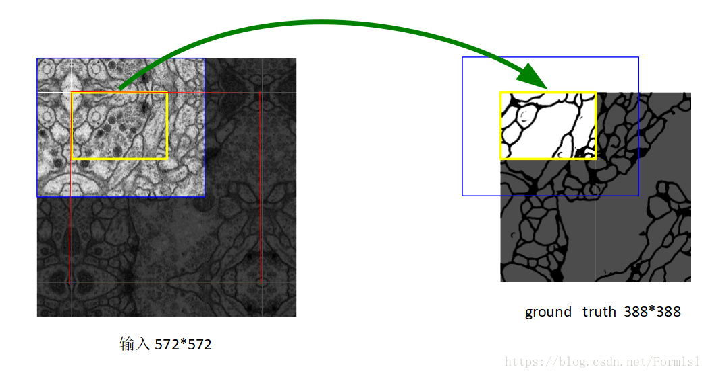
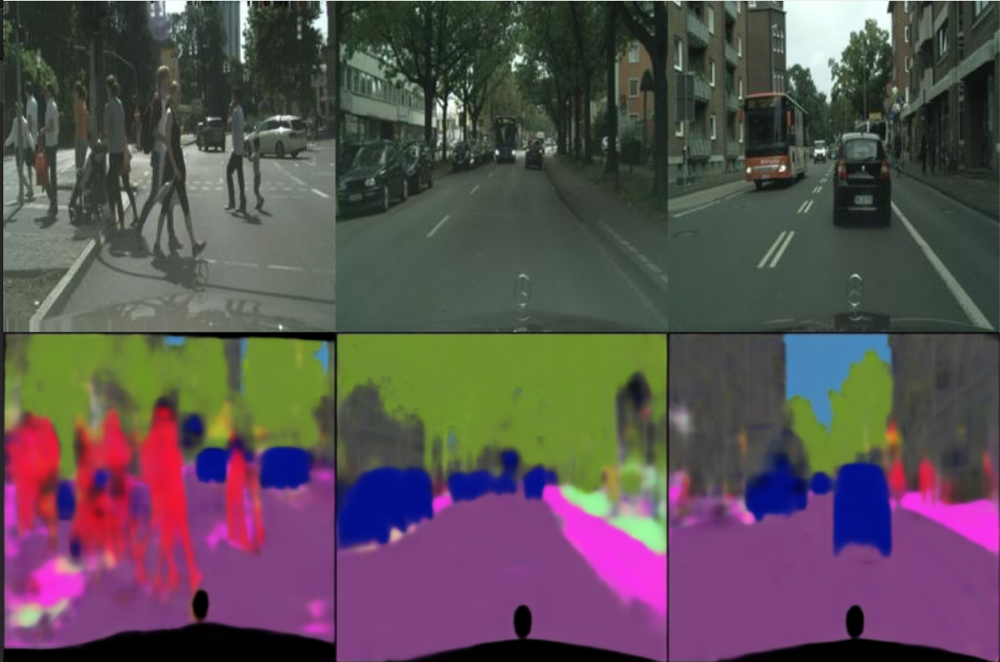

# Implementation of Segmentation AutoEncoder

This implementation used UNet applying on cityscapes segmentation.

---

#### UNet Architecrure      
<p></p>
<center>

</center>

Figure 1: image is taken from [source](https://lmb.informatik.uni-freiburg.de/research/funded_projects/bioss_deeplearning/)   

<center>   
   
</center>

Figure 2: image is taken from [source](https://blog.csdn.net/Formlsl/article/details/80373200)   

### Training on cityscapes
<p></p>
<center>

</center>

### Requirement
```
python==3.7.0
numpy==1.18.1
```
### How to use
Training & Prediction can be run as follows:    
`python train.py train`  
`python train.py predict_all`  


### More information
* Please refer to the original paper of UNet [here](https://towardsdatascience.com/understanding-semantic-segmentation-with-unet-6be4f42d4b47?gi=29547fc66b2b) for more information.

### Implementation Note    

Since datasets are somehow huge and painfully slow in training ,I applied online loading (by batch) instead of loading the data completely at the beginning. This will eventually not consume the memory.

### Result for cityscapes:
* img_size = 572 * 572
* Learning rate = 0.00001
* Batch size = 4  
* Optimizer  = Adam   

<p></p>
<center>

</center>
